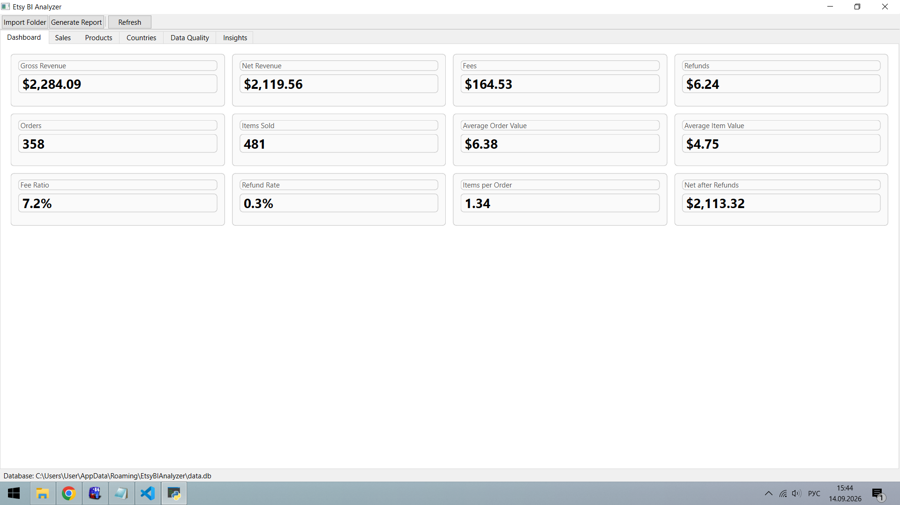
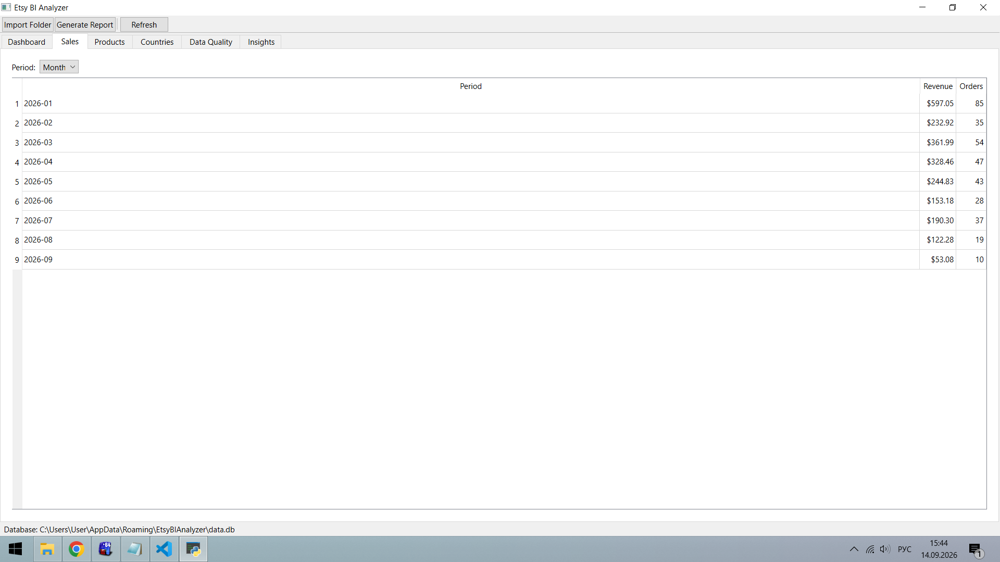
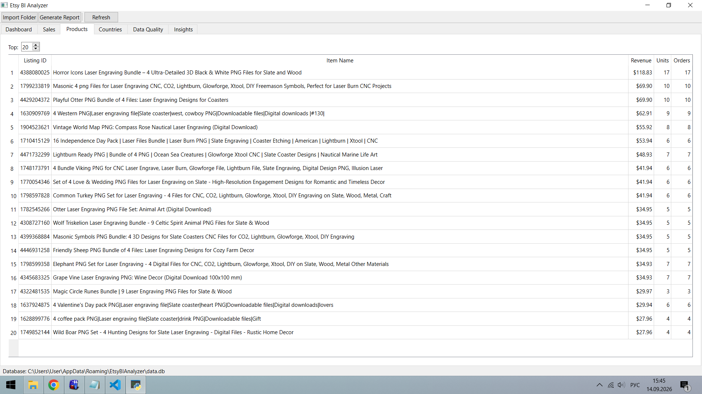
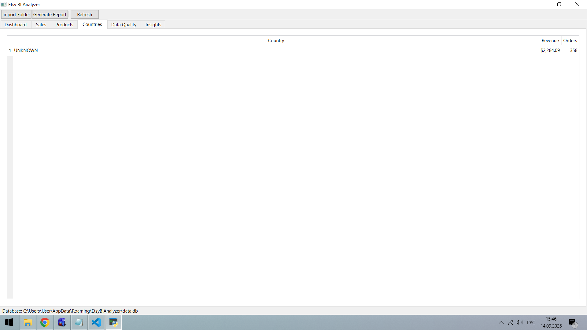
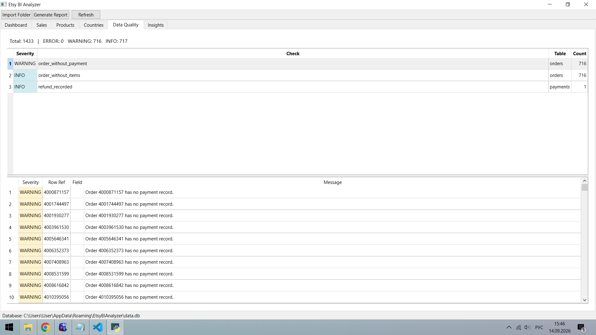
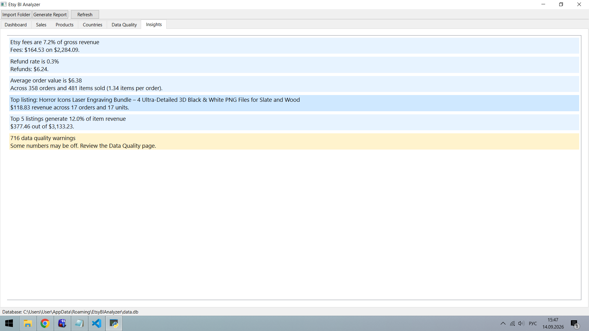

# Etsy BI Analyzer

A desktop application that turns Etsy Shop Manager CSV exports into a
business report — sales analytics, product performance, financial
breakdown, and data quality checks.

Built with Python, PySide6, and SQLite. Ships as a standalone Windows
executable.



## Why

Etsy sellers can export CSVs from their shop, but raw exports are just
spreadsheets. There is no built-in view of revenue over time, top
products, refund rate, or fee ratio across multiple files. This tool
imports the exports, validates them, and produces a single report.

## What it does

- Imports five Etsy CSV export types (orders, order items, payments,
  deposits, listings)
- Validates and normalizes data, records every problem it finds
- Stores everything in a local SQLite database
- Calculates KPIs: gross/net revenue, fees, refunds, AOV, fee ratio,
  refund rate, items per order
- Cross-checks tables against each other (reconciliation)
- Generates rule-based business insights
- Exports a multi-sheet Excel report
- Ships as a single `.exe` — no Python required for end users

## What it does NOT do

- No Etsy API integration. Everything works from manual CSV exports.
- No cloud, no accounts, no telemetry.
- No profit calculation — Etsy does not know your production costs.
- No per-product fee attribution — Etsy records fees at the order level.
- No multi-currency support. USD only.
- No ABC analysis over the entire catalog — the catalog export has no
  `listing_id`, so it cannot be joined to sales.

Every limitation is documented. See `docs/`.

## Screenshots

### Sales



### Products



### Countries



### Data Quality



### Insights



## Stack

| Layer | Choice |
|---|---|
| Language | Python 3.12 |
| UI | PySide6 (Qt 6) |
| Database | SQLite |
| Data | pandas |
| Excel | openpyxl |
| Packaging | PyInstaller |
| Tests | pytest |

## Install and run

For end users, download the latest `.exe` from
[Releases](https://github.com/Fyshbaiev/etsy-bi-analyzer/releases).

For developers:

```powershell
git clone https://github.com/Fyshbaiev/etsy-bi-analyzer.git
cd etsy-bi-analyzer
python -m venv .venv
.\.venv\Scripts\Activate.ps1
pip install -e ".[dev]"
python -m src.app.main
Build the executable
powershell
python scripts/build.py
Output: dist/EtsyBIAnalyzer/EtsyBIAnalyzer.exe.

Full instructions: docs/build.md.

Project structure
etsy-bi-analyzer/
├── src/
│   ├── app/            PySide6 UI (main window, pages)
│   ├── core/           config and paths
│   ├── importer/       CSV parsers and import service
│   ├── database/       SQLite schema and repositories
│   ├── analytics/      KPI and reconciliation
│   ├── insights/       rule-based findings
│   └── reports/        Excel generator
├── tests/              pytest
├── docs/               documentation and ADRs
├── scripts/            build tooling
└── pyproject.toml
Documentation
Data Contracts — every CSV format, its
columns, and validation rules

Metrics — formulas for every KPI

Reconciliation — cross-table checks and
severities

Architecture — layers, dependencies, data flow

Build — how the .exe is produced

ADRs — architecture decision records

How revenue is calculated
Revenue comes only from the payments table, never from orders.
This is important: SoldOrders has several similar-looking amounts
(Order Value, Order Total, Order Net) that are not the same
thing. See docs/metrics.md for details.

Data privacy
The application processes personally identifiable information
(customer names, addresses, emails) that appears in Etsy CSV exports.
These files are never committed to this repository. The data/ folder
is in .gitignore. Test fixtures contain only synthetic data.

License
MIT — see LICENSE.